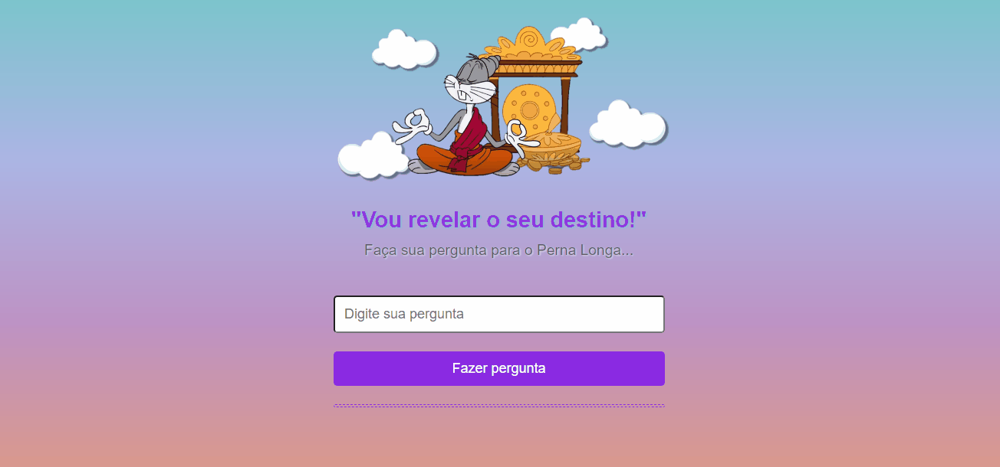

<h1 align="center">Revelador de destino</h1>

Site interativo que responde as perguntas do usuário.

<h1 align="center">
  
</h1>

---
### Tecnológias

As seguintes ferramentas foram usadas na construção do projeto:

<ul>
    <li>HTML</li>
    <li>CSS</li>
    <li>Javascript</li>
</ul>

---
### Link

  <a href="https://giselle-souza.github.io/Revelador-de-Destino/" target="_blank">Clique aqui</a> para consultar o seu destino também!

---

### Fontes e sites utilizados durante o projeto

<ul>
    <li><a href="https://www.freecodecamp.org/portuguese/news/tutorial-sobre-button-onclick-em-html-e-evento-de-clique-em-javascript/#:~:text=O%20evento%20onclick%20executa%20determinada,tag%20de%20abertura%20do%20bot%C3%A3o." target="_blank">Onclick</a>
        O evento onclick executa determinada funcionalidade quando um botão é clicado. 
    <li>.innerHTML:
        Adiciona o conteúdo da variável no HTML. Retorna o texto com formatações e elementos HTML.
    <li><a href="https://developer.mozilla.org/pt-BR/docs/Web/API/Element/setAttribute" target="_blank">Element.setAttribute():</a>
        Adiciona um novo atributo ou modifica o valor de um atributo existente num elemento específico.
    <li><a href="https://developer.mozilla.org/en-US/docs/Web/API/setTimeout" target="_blank">setTimeout():</a>
        Define um cronômetro que executa uma função ou trecho de código especificado assim que o cronômetro expirar.
    <li><a href="https://www.fronteditor.dev/" target="_blank">Editor Front Editor</a>
</ul>
